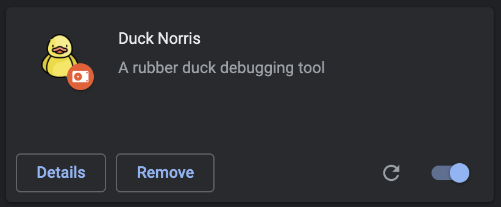

# Duck Norris - Explain It To The Duck!

## A Google Chrome Extension To Ditch The Need For A Physical Rubber Duck

### ~ The idea behind the project ~

> In software engineering, rubber duck debugging is a method of debugging code. The name is a reference to a story in the book The Pragmatic Programmer in which a programmer would carry around a rubber duck and debug their code by forcing themselves to explain it, line-by-line, to the duck. Many programmers have had the experience of explaining a problem to someone else, possibly even to someone who knows nothing about programming, and then hitting upon the solution in the process of explaining the problem. In describing what the code is supposed to do and observing what it actually does, any incongruity between these two becomes apparent. More generally, teaching a subject forces its evaluation from different perspectives and can provide a deeper understanding. By using an inanimate object, the programmer can try to accomplish this without having to interrupt anyone else. ([Wikipedia](https://en.wikipedia.org/wiki/Rubber_duck_debugging))

### ~ Main Features ~

The Duck Norris extension solves the problem of not having a physical rubber duck with the user at all times.
With the Speech Recognition API the user can explain their code to Duck Norris who will record the line-by-line explanation in text format which then can be read back and also saved into a text file.

The extension also makes use of the browser's local storage by automatically saving the last recording there so that it doesn't get lost if the pop up gets closed by accident.

## Screenshots

## Demo

A video demo is available on [YouTube](https://youtu.be/aFo2vF9sHV0).

## Local Install

1. Clone repo: `git clone https://github.com/juditlehoczki/rubber-duck-debugging.git`

2. Open Google Chrome > Settings > Extensions

3. Turn on Developer Mode

4. Choose "Load unpacked" and load in the 'rubber-duck-debugging' folder

5. Pin Duck Norris to the Extension Toolbar

6. Click the Duck Norris icon

## Tech Stack

- written in Vanilla JavaScript, HTML and CSS
- built with [Web Speech](https://developer.mozilla.org/en-US/docs/Web/API/Web_Speech_API) and [Local Storage](https://developer.mozilla.org/en-US/docs/Web/API/Window/localStorage) APIs
